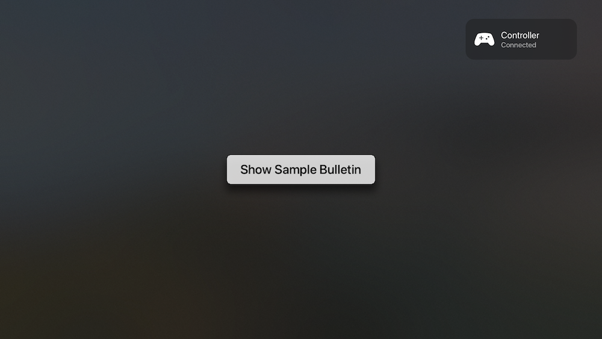

# KBBulletinView

Bulletin / 'Toast' style view for tvOS. 

This project is an effort to create local application notifications/alerts similar to those used by Apple in the top right when various system events occur (ie devices attach/detach, internet connectivity changes, etc)

[](https://travis-ci.org/lechium/KBBulletinView)
[](https://cocoapods.org/pods/KBBulletinView)
[](https://cocoapods.org/pods/KBBulletinView)
[](https://cocoapods.org/pods/KBBulletinView)

## Example

```Objective-C
    
    KBBulletinView *bv = [KBBulletinView bulletinWithTitle:@"Controller" description:@"Connected" image:[[UIImage imageNamed:@"gamecontroller"] imageWithRenderingMode:UIImageRenderingModeAlwaysTemplate]];
    [bv showForTime:5];

```

  <br/>

To run the example project, clone the repo, and run `pod install` from the Example directory first.

## Requirements

## Installation

KBBulletinView is available through [CocoaPods](https://cocoapods.org). To install
it, simply add the following line to your Podfile:

```ruby
pod 'KBBulletinView'
```

## Author

lechium, kevin.w.bradley@me.com

## License

KBBulletinView is available under the MIT license. See the LICENSE file for more info.
